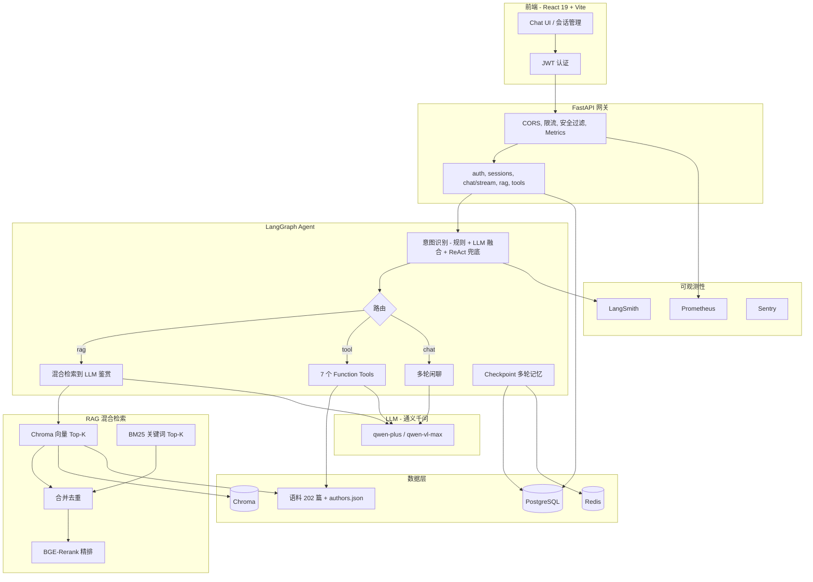

# 古典诗词鉴赏智能助手

> 已上线运行的 RAG + LangGraph Agent 全栈应用 · [cnpoetry.top](https://cnpoetry.top/)

[](https://cnpoetry.top/)
[](https://github.com/xiaduobao/poetryAgent)

## 在线体验

**[https://cnpoetry.top/](https://cnpoetry.top/)** — 注册登录后即可使用：诗词赏析、作者查询、格律分析、看图作诗、SSE 流式对话等。

## 功能演示

<video src="https://github.com/user-attachments/assets/33d2ec4f-bdd1-483a-a16d-7beff677d802" controls width="100%" playsinline poster="docs/materials/poster.png">
  <a href="https://github.com/user-attachments/assets/33d2ec4f-bdd1-483a-a16d-7beff677d802">下载演示视频</a>
</video>

## 项目简介

面向古典诗词鉴赏场景的**端到端 AI 应用**：自建 202 篇语料知识库，混合检索 + Agent 工具链驱动多轮对话，已部署至生产环境并对外提供服务。

| 层级 | 技术 |
|------|------|
| 后端 | Python 3.11 + FastAPI + SQLAlchemy 2.0 异步 |
| 前端 | React 19 + Vite + shadcn/ui + Tailwind |
| Agent | LangGraph 意图路由 + 7 个 Function Calling 工具 |
| RAG | BGE-small-zh + Chroma + BM25 混合检索 + BGE-Rerank |
| 数据 | PostgreSQL 16 + Redis 7 + Alembic |
| LLM | 通义千问（DashScope） |
| 部署 | Docker Compose · 阿里云 ECS · [cnpoetry.top](https://cnpoetry.top/) |

### RAG 检索评估（2026-06-19）

| 指标 | 离线 smoke | Ragas（LLM 评判） |
|------|------------|-------------------|
| Golden set | 30 条 | 30 条 |
| 检索通过率 | **100%**（30/30） | — |
| 平均召回 | **3.33** 篇/查询 | — |
| Context Recall | — | **0.68** |
| 语料规模 | 202 篇 | 202 篇 |

- 离线报告：[reports/rag_eval.json](reports/rag_eval.json)
- Ragas 报告：[reports/ragas.json](reports/ragas.json)（`context_recall`，评判模型 `qwen-turbo`）

详见 [测试与 RAG 评估](docs/testing-and-evaluation.md)。

## 架构

系统由 React 前端、FastAPI 网关、LangGraph Agent、RAG 混合检索、7 类工具链与 PostgreSQL/Redis/Chroma 数据层组成。更细的时序图与模块说明见 **[架构文档](docs/architecture.md)**。



## 文档导航

| 文档 | 说明 |
|------|------|
| **[docs/README.md](docs/README.md)** | 📖 **文档首页** — 完整指引与索引 |
| [architecture.md](docs/architecture.md) | 系统架构、Mermaid 流程图、模块对应 |
| [getting-started.md](docs/getting-started.md) | 本地开发：环境、向量库、前后端启动 |
| [deployment.md](docs/deployment.md) | 阿里云 ECS / ACR 生产部署 |
| [deploy-troubleshooting.md](docs/deploy-troubleshooting.md) | 部署故障排查 |
| [testing-and-evaluation.md](docs/testing-and-evaluation.md) | pytest、pre-commit、RAG 评估 |
| [observability.md](docs/observability.md) | LangSmith 追踪与监控指标 |
| [api-examples.md](docs/api-examples.md) | REST / SSE API 示例 |
| [corpus-management.md](docs/corpus-management.md) | LLM 批量生成语料、手动扩展 |
| [interview-highlights.md](docs/interview-highlights.md) | 技术亮点与面试讲解提纲 |
| [project-notes.md](docs/project-notes.md) | 开发问答与问题记录 |

## 快速开始

```bash
git clone https://github.com/xiaduobao/poetryAgent.git && cd poetryAgent
python3.11 -m venv .venv && source .venv/bin/activate
pip install -r requirements.txt -i https://pypi.tuna.tsinghua.edu.cn/simple --default-timeout=120
cp .env.example .env   # 填入 OPENAI_API_KEY（DashScope）
python scripts/build_index.py
docker compose -f docker-compose.infra.yml up -d
uvicorn app.main:app --reload --host 0.0.0.0 --port 8000
# 另开终端：cd frontend && npm install && npm run dev → http://localhost:5173
```

完整步骤（模型镜像、依赖排查、Docker 全栈等）见 **[本地开发指南](docs/getting-started.md)**。

## 许可证

MIT License
