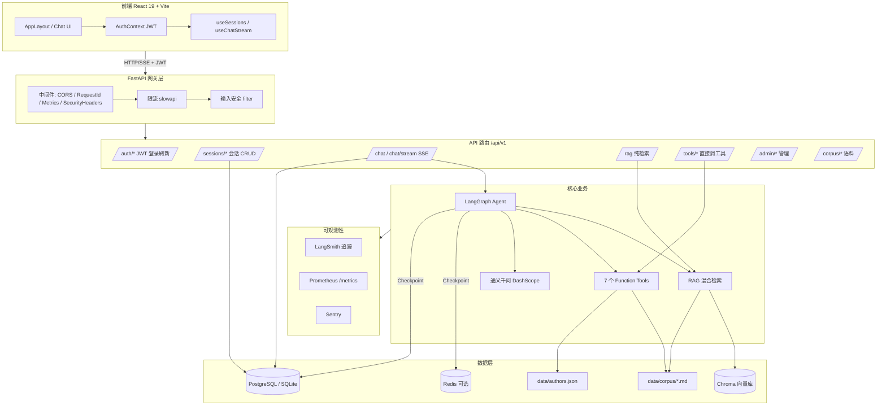
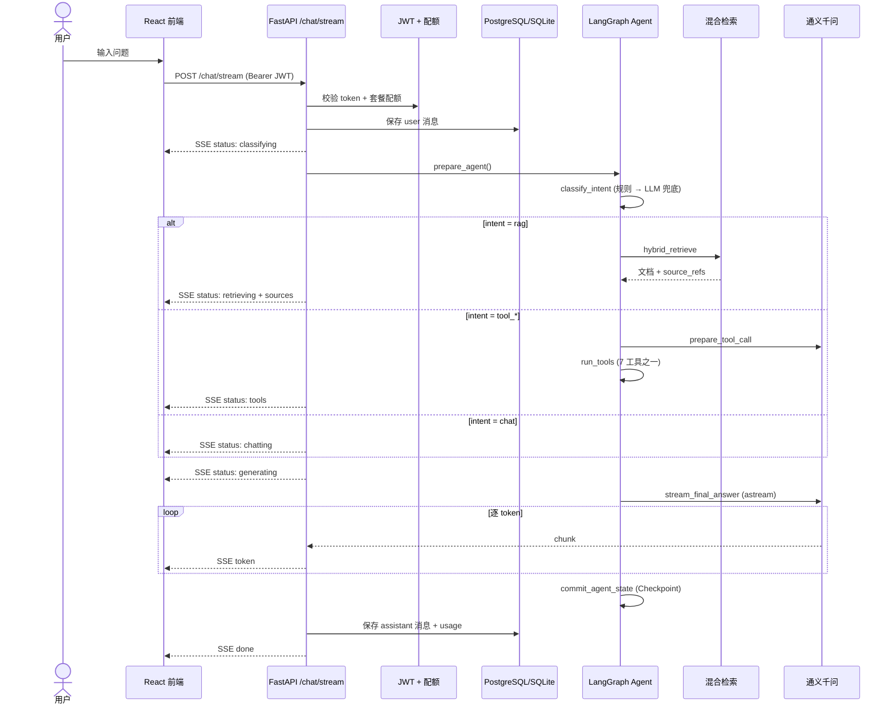
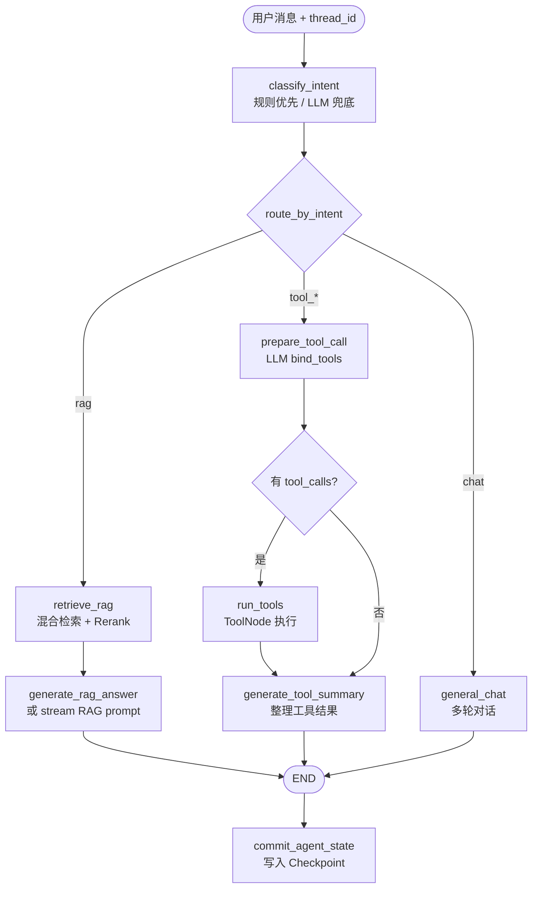
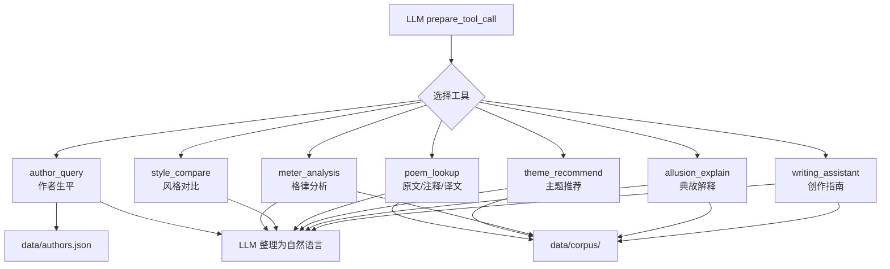
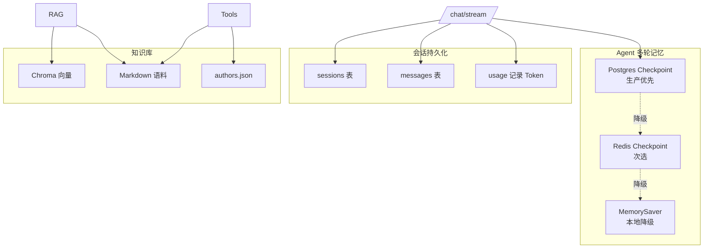
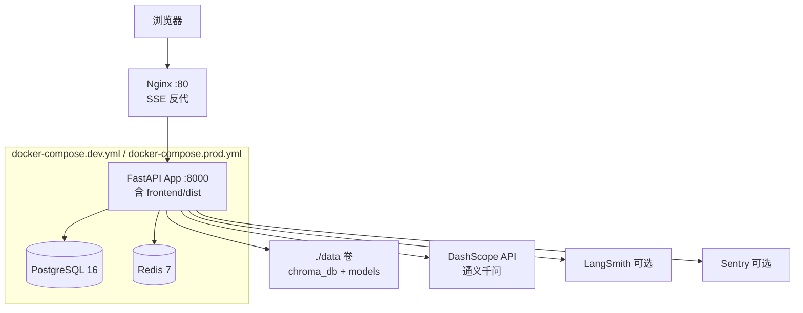

# poetryAgent 架构与流程图

> 古典诗词鉴赏智能助手 · React 前端 + FastAPI 后端 + LangGraph Agent + RAG + 工具链  
> 线上站点：[https://cnpoetry.top/](https://cnpoetry.top/) · 返回 [文档首页](README.md)

---

## 1. 系统总览



---

## 2. 一次聊天请求的完整流程（SSE 流式）



**SSE 事件类型**：`status` → `subtasks`（复合问题时）→ `sources`（RAG 时）→ `token` → `done`

**复合意图**（`COMPOUND_INTENT_ENABLED=true`）：`decomposing` → 并行子任务 `executing` → `generating` 合成回答。单条消息如「介绍杜甫并赏析《登高》」会拆解为多子任务分别走 RAG/工具，再合成。

---

## 3. LangGraph Agent 工作流

Agent 定义在 `app/agent/graph.py`，核心是 **意图识别 → 三路分支 → LLM 生成**。启用 `COMPOUND_INTENT_ENABLED` 时入口为 `decompose_node`，复合问题经 LangGraph `Send` 并行 `execute_subtask` 后 `merge_subtasks` 合成。



### 意图类型（规则 + LLM）

| 意图 | 触发示例 | 分支 |
|------|----------|------|
| `rag` | 赏析、鉴赏、《诗题》 | RAG → LLM |
| `tool_author` | 介绍杜甫 | 作者工具 |
| `tool_meter` | 分析格律 | 格律工具 |
| `tool_compare` | 李白 vs 杜甫 | 对比工具 |
| `tool_lookup` | 查找原文/注释 | 诗词查找 |
| `tool_theme` | 推荐思乡诗 | 主题推荐 |
| `tool_allusion` | 典故含义 | 典故解释 |
| `tool_writing` | 写一首、仿写 | 创作助手 |
| `chat` | 闲聊 | 直接 LLM |

---

## 4. RAG 检索流水线

```mermaid
flowchart LR
    subgraph Offline["离线建索引 scripts/build_index.py"]
        MD[data/corpus/*.md] --> Chunk[chunker 分块<br/>100 token 重叠]
        Chunk --> Embed[BGE-small-zh Embedding]
        Embed --> Chroma[(Chroma data/chroma_db)]
    end

    subgraph Online["在线检索 HybridRetriever"]
        Query[用户 query] --> Vec[向量检索 Top-K]
        Query --> BM25[BM25 关键词 Top-K]
        Vec --> Merge[合并去重]
        BM25 --> Merge
        Merge --> Filter[可选过滤<br/>author/dynasty/genre]
        Filter --> Rerank[BGE-Reranker 精排]
        Rerank --> Context[format_context<br/>带 [1][2] 引用]
        Context --> LLM[LLM 鉴赏生成]
    end

    Chroma --> Vec
    MD --> BM25
```

---

## 5. 工具链（Function Calling）



---

## 6. 数据与持久化



### 环境对比

| 环境 | 数据库 | Checkpoint | 限流 |
|------|--------|------------|------|
| 本地开发 | SQLite | MemorySaver | 进程内 |
| Docker/ECS | PostgreSQL | Redis / Postgres | Redis |

---

## 7. 部署架构



---

## 8. 目录与模块对应

```
poetryAgent/
├── frontend/          → React UI（SSE 客户端）
├── app/
│   ├── main.py        → FastAPI 入口 + 中间件 + 路由挂载
│   ├── api/           → chat / sessions / rag / tools
│   ├── auth/          → JWT + 多租户配额
│   ├── agent/         → LangGraph 图 + LLM + Prompt
│   ├── rag/           → 分块 / Embedding / 混合检索 / Rerank
│   ├── tools/         → 7 个业务工具实现
│   ├── db/            → SQLAlchemy 模型 + CRUD
│   ├── security/      → 输入过滤 + 限流
│   └── observability/ → LangSmith / Prometheus / Sentry
├── data/
│   ├── corpus/        → 诗词 Markdown 语料
│   ├── chroma_db/     → 向量库
│   └── authors.json   → 作者库
└── scripts/
    ├── build_index.py → 离线建索引
    └── deploy/        → ECS 部署脚本
```

---

## 9. 启动生命周期

应用启动时（`app/main.py` lifespan）依次：

1. 初始化日志 / Sentry / LangSmith
2. `init_db()` — Alembic 迁移 + 建表
3. `setup_checkpointer()` — Postgres → Redis → MemorySaver
4. `build_vector_store()` — 加载或构建 Chroma

---

## 10. 技术栈速查

| 层级 | 技术 |
|------|------|
| 后端 | Python 3.11 + FastAPI + SQLAlchemy 2.0 异步 |
| 前端 | React 19 + Vite + shadcn/ui + Tailwind + AuthContext |
| 认证 | JWT（access + refresh）+ 多租户配额 |
| 数据 | **生产**：PostgreSQL 16 + Alembic；**本地**：SQLite |
| 缓存/Checkpoint | **生产**：Redis 7；**本地**：MemorySaver 降级 |
| Agent | LangChain + LangGraph |
| RAG | BGE-small-zh + Chroma + BM25 混合检索 + BGE-Rerank |
| LLM | 通义千问（DashScope OpenAI 兼容 API） |
| 可观测 | LangSmith、Prometheus `/metrics`、Sentry、Token 计量 |
| 部署 | Docker Compose（Postgres + Redis + App） |
