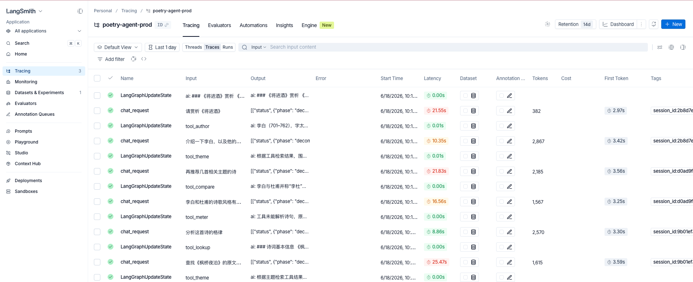

# 可观测性（LangSmith）

> 返回 [文档首页](README.md)



项目已集成 [LangSmith](https://smith.langchain.com/)，用于追踪 Agent 全链路：API 根 Run → 意图识别 → RAG/工具 → LLM 流式生成。

## 启用方式

在 `.env` 中配置（参见 `.env.example`）：

| 变量 | 说明 |
|------|------|
| `LANGSMITH_API_KEY` | [LangSmith API Key](https://smith.langchain.com/settings) |
| `LANGSMITH_TRACING` | 设为 `true` 启用追踪 |
| `LANGSMITH_PROJECT` | 项目名，默认 `poetry-agent`；可用 `poetry-agent-dev` / `poetry-agent-prod` 区分环境 |

```bash
LANGSMITH_TRACING=true
LANGSMITH_API_KEY=lsv2_pt_...
LANGSMITH_PROJECT=poetry-agent-dev
```

重启后端后，在 LangSmith UI 的对应 Project 中即可看到每次 `/chat`、`/chat/stream`、`/rag`、`/tools/*` 的 Run 树。

## Run 树结构

```
chat_request（根）
├── prepare_agent
│   ├── classify_intent（metadata: intent_source, final_intent）
│   ├── retrieve_rag / prepare_tool_call + run_tools
│   └── hybrid_retrieve（metadata: doc_count, top_scores）
└── stream_final_answer / collect_stream（metadata: ttft_ms, mode）
```

可按 tag `session_id:<uuid>` 过滤同一会话的多轮对话。

## 推荐监控指标

在 LangSmith Dashboard 中可按 metadata 聚合以下指标：

| 优先级 | 指标 | metadata / 字段 |
|--------|------|-----------------|
| P0 | E2E 延迟 p50/p95 | 根 Run `latency` |
| P0 | 流式 TTFT | `ttft_ms` |
| P0 | 错误率 | Run `status=error` |
| P0 | Token 用量 / 成本 | LLM Run 自动记录 |
| P1 | 意图分布 | `intent` |
| P1 | 规则命中率 | `intent_source=rule` |
| P1 | RAG 空召回率 | `doc_count=0` |
| P1 | 工具成功率 | `tool_results` |
| P2 | 每会话轮数 | tag `session_id:*` |

建议创建三个视图：**Ops**（延迟/错误）、**Cost**（Token/意图分组）、**Quality**（意图分布/空召回/工具错误）。

## 其他可观测组件

| 组件 | 说明 |
|------|------|
| Prometheus | `/metrics` 端点，请求计数与延迟 |
| Sentry | 生产异常上报（`.env.prod` 配置 `SENTRY_DSN`） |
| Token 计量 | 会话级 usage 记录，配合套餐配额 |

详见 [架构文档 · 系统总览](architecture.md#1-系统总览)。
